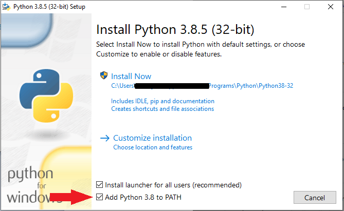
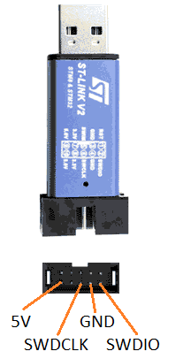
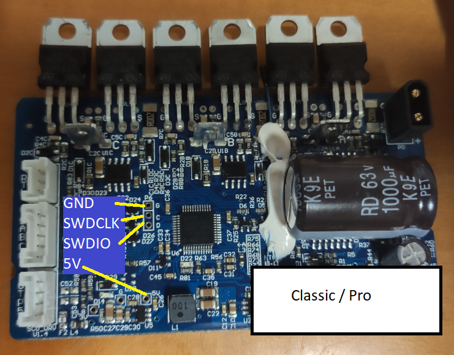
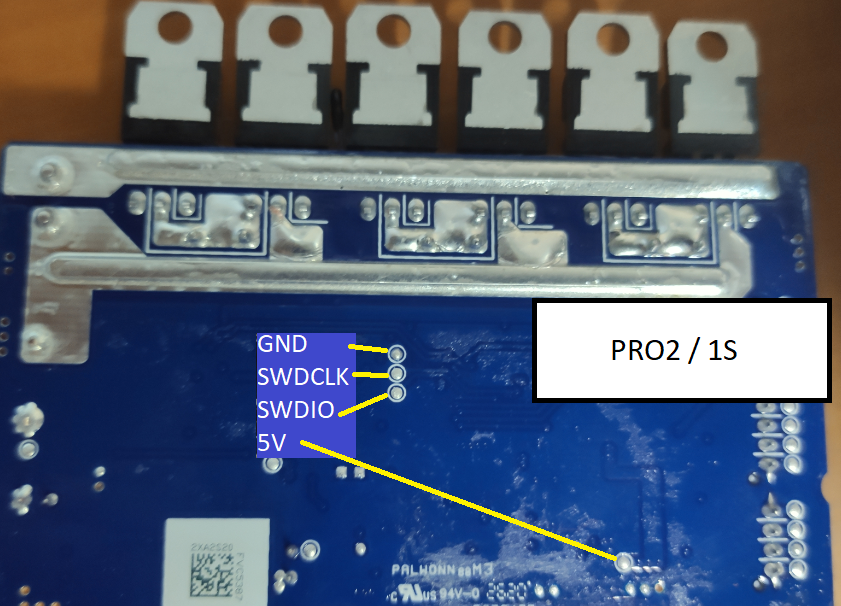
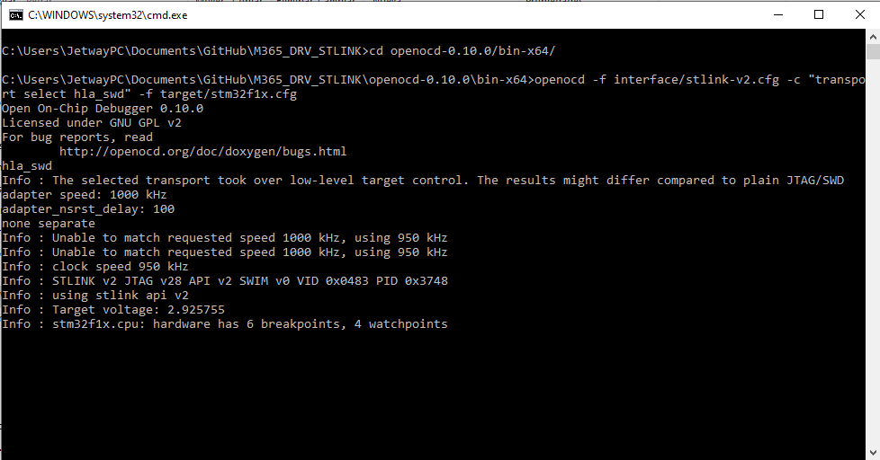
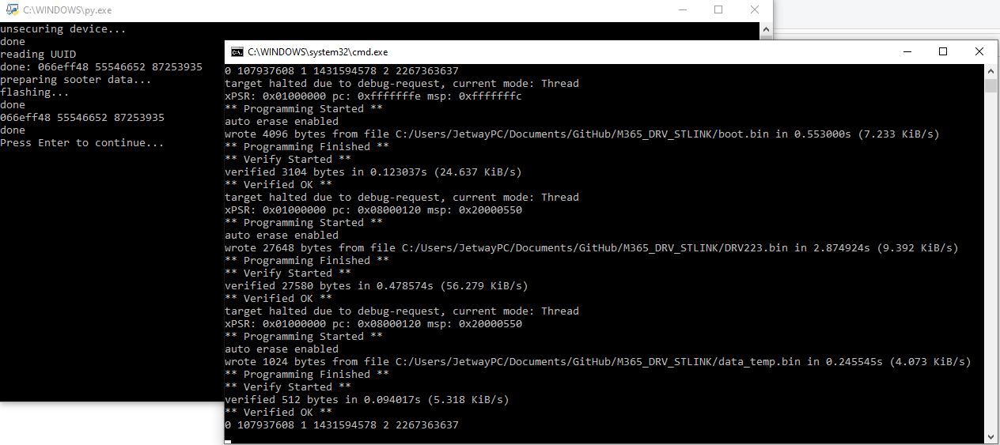

# M365_DRV_STLINK
M365 driver esc recover using stlink, if it doesnt start due to DRV BRICK.
* make sure that the DRV is bricked. (perhaps the brick is caused by the BLE board)
# What is needed?
* ST-LINK V2 or similar programmer
* ST-LINNK drivers, install ST_LINK_SETUP.exe
* [Python 3.8](https://www.python.org/downloads/)- make sure to check Add Python to path

* Some dupont wires and some aligator clips
* Bricked part and optionaly its Serial number (you can put any serial)
* Optional some solder equipment or someone to help you holding the wires in place
* patience
# flashing

1. Select the flash_m365_....py acording to your scooter.
  * open it on a text editor, on line 26 you can find something that goes like this

        serial ='13678/00110000'
        KM=0

  * replace the data to match your actual scooter serial and KM
3. Disasemble scooter and extract the drv from its case
  * Make sure the capacitor is discharged. To achieve this disconnect the battery, try to turn the scooter on and wait until the red light fades
2. Hold wires in place, solder them, or ask help for a friend to hold them during the process

3. Launch start_ocd_STLINKV2.bat, should start like this, if it doesnt, check the wirig, open STM32 STLink Utility, try to connect to target to check if stlink is working

4. Launch flash_m365_....py acording to your scooter model.
5. Wait, if it fails and closes check the wiring, close everithing and restart from step 2. 
* open STM32 STLink Utility and try to connect to target to check if stlink is working.
6. If everithing works you should see something like this:

